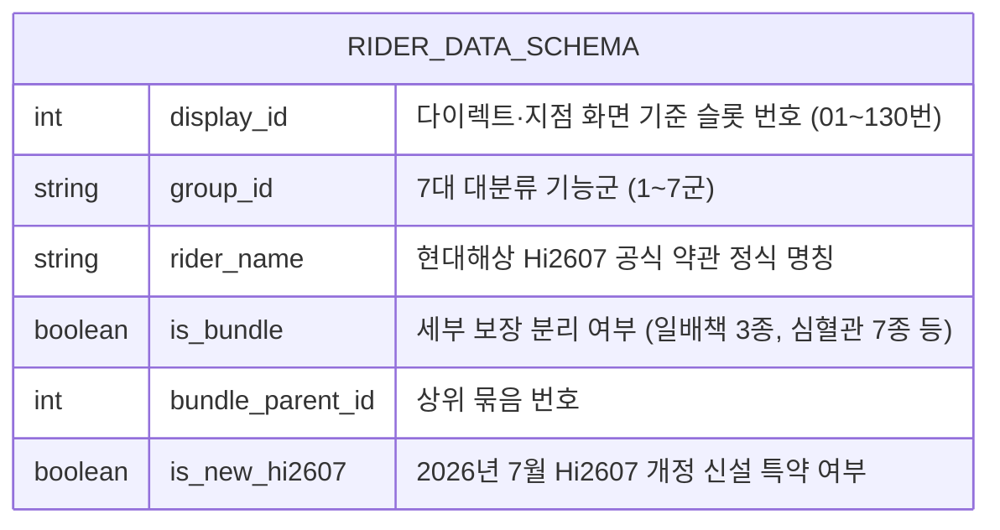

# [전수 특약 매트릭스] 현대해상 굿앤굿어린이종합보험Q (Hi2607) 130개 담보 전수 조사 및 실전 세팅 매뉴얼

- **작성 및 검증 기준일:** 2026년 10월 기준 편집본 (기존 분석을 공식 상품 안내와 재대조하고 문서 간 숫자를 재검산함)
- **대상 상품:** 현대해상 무배당 굿앤굿어린이종합보험Q (Hi2607)
- **목적:** 다이렉트 견적 화면에 실제로 등장하는 전체 선택 특약을 화면 스크롤 순서대로 전수 나열하고, **'실비 포함 월 5~6만 원대 / 20년납 30세 만기'** 완성을 위한 각 특약별 세팅값(`[✅ 가입]` vs `[❌ 미가입]`)과 다각도 평가(약관 팩트 / 커뮤니티 데이터 / 설계 판단)를 1:1로 제공.

---

## 🧭 특약 3단 다각도 평가 체계 및 중복·대체성 정밀 기준

본 매트릭스의 모든 특약은 다음 3대 기본 평가 기준 및 3대 중복·대체성 분석 프레임워크를 기반으로 엄격히 평가되었습니다:

### 1. 기본 평가 기준
1. **[약관상 사실 (Fact)]**: 보장 질병코드(KCD), 지급 요건, 면책 규정, 갱신/비갱신 여부, 가입 가능 주수.
2. **[커뮤니티 평가 (Data)]**: DC인사이드 보험갤러리, 뽐뿌, 맘카페 실가입자들의 실제 보상 청구 후기 및 집단지성 선호도.
3. **[작성자 추천 등급 (Grade)]**:
   - **Grade A (핵심 필수):** 치명적 위험(소아암, 뇌혈관, 선천이상, 후유장해) 대비 가성비 최상위 담보.
   - **Grade B (조건부 권장):** 개인 상황(고령 산모, 가족력 등)에 따라 선택 가능한 합리적 담보.
   - **Grade C (비효율/배제):** 실손의료비로 충당 가능, 협소한 지급 요건, 또는 타 담보로 충분히 흡수 가능한 담보.

### 2. 3대 중복·대체성 분석 기준 (Duplication & Substitution Framework)
- **① 동시지급(중복 수령) 가능 여부:**
  - *정액 담보 간:* 서로 다른 정액 담보가 함께 지급될 수 있지만, 실제 지급 여부·수술 분류·횟수 제한은 각 특약 약관에 따릅니다. 동일 사고라고 **항상 각각 전액 지급된다고 단정하지 않습니다.**
  - *실손의료비 연계:* 실손의료비는 실제 발생한 본인부담금 비례보상이므로, 단순 입원일당이나 통원치료비처럼 실손으로 충분히 충당되는 소액 정액 특약은 보험료 대비 실익을 따져 배제합니다.
- **② 보장범위 중복도 (Overlap Ratio):**
  - *높음:* 상위 포괄 담보가 하위 특정 담보를 포괄 흡수 (예: 기본 상해후유장해 vs 교통상해후유장해, 일반 골절진단비 vs 5대골절진단비 ➔ 하위 담보 배제).
  - *중간:* 보장 대상의 일부 영역이 중첩되나 약관상 판정 기준이나 지급 방식이 다름 (예: 질병후유장해 3%~ vs 8대장애진단비 ➔ 질후 5천 집중 후 8대장애 선택적 보강).
  - *낮음:* 보장 질병군이나 위험 원인이 완전히 분리 (예: 암 진단비 vs 뇌혈관질환 진단비 ➔ 각각 독립 한도 구성).
- **③ 실손 대체성 (Indemnity Substitutability):**
  - *높음 (실손과 목적이 겹칠 수 있음):* 일반 성인 질병입원일당·통원치료비 등은 실손과 목적이 겹칠 수 있으므로, 급여·비급여 자기부담금과 특약 보험료를 함께 비교해 우선순위를 정합니다.
  - *낮음/불가 (실손 대체 불가):* 소아암, 뇌혈관질환, 영구 신체 장해, 조산아 인큐베이터 입원 등은 부모 간병 휴직비, 특수 재활치료비, 1인실 병실료 차액 등 실손 한도를 초과하는 거대 지출이 발생하므로 고액 정액 담보가 필수적임.

---

## 🗂️ 데이터 모델 명세 및 특약 수량 집계 기준 (Cardinality Definition)

본 매트릭스는 현대해상 굿앤굿어린이종합보험Q (Hi2607) 전산 화면 및 공식 약관의 전체 담보를 다음의 정밀 데이터 모델 스키마에 따라 체계적으로 분류·관리합니다:

### 1. 특약 총 수량 정의 및 카디널리티 정합성 (Cardinality Formula)
- **화면 기준 슬롯 수 (Display Slots):** 총 130번 슬롯 체계 (01~130번)
  - *결번 슬롯 18개 (Historical Legacy Slots):* 과거 상품 개정(Hi2605 이전) 시 폐지되었거나 오프라인 대면 지점 전용 스코어링 특약으로 다이렉트 전산에서는 비활성화된 슬롯: **56~60, 74~75, 86~95, 105번** (총 18개 결번).
  - *기본 유효 슬롯 수:* 130개 - 18개 결번 = **112개 슬롯**.
- **세부 분리 담보 (Sub-item Bundles): +12개 담보**
  - 슬롯 25 (일배책 3종: 25-1, 25-2, 25-3 ➔ +2)
  - 슬롯 35 (뇌혈관 2종: 35-1, 35-2 ➔ +1)
  - 슬롯 38 (심혈관 7종: 38-1~38-7 ➔ +6)
  - 슬롯 50 (특정/신생아요로감염: 50, 50-1 ➔ +1)
  - 슬롯 52 (아토피 표적치료: 52, 52-1 ➔ +1)
  - 슬롯 85 (안과통합치료: 85, 85-1 ➔ +1)
- **실제 파싱된 실질 개별 특약 총수 (Actual Parsed Unique Riders): 총 124개 행**
  - 기본 유효 112개 + 세부 분리 12개 = **정확히 124개 행 (검증 스크립트 `verify_integrity.ts` 동적 파싱 검증 완료)**.

---

## 📑 목차 및 기능군별 특약 분포 (총 124종 전수 파싱)

1. [제1군: 기본계약 및 상해 관련 담보 (27종)](#1-제1군-기본계약-및-상해-관련-담보-27종)
2. [제2군: 질병 진단비 및 치료비 담보 (39종 — 7월 신설 2종 포함)](#2-제2군-질병-진단비-담보-39종)
3. [제3군: 질병 입원일당 담보 (13종)](#3-제3군-질병-입원일당-담보-13종)
4. [제4군: 질병 수술비 및 처치비 담보 (11종 — 7월 신설 1종 포함)](#4-제4군-질병-수술비-담보-11종)
5. [제5군: 태아 전용 특약 (기간·종료 조건은 특약별 확인)](#5-제5군-태아-전용-특약-기간종료-조건은-특약별-확인)
6. [제6군: 모성(산모) 전용 특약 (11종 — Hi2607 양수검사비 등 신규 반영)](#6-제6군-모성산모-전용-특약-11종)
7. [제7군: 치아·정신·생활·배상책임 담보 (14종)](#7-제7군-치아정신생활배상책임-담보-14종)

---

## 1. 제1군: 기본계약 및 상해 관련 담보 (27종)

| 번호 | 특약 정식 명칭 | 화면 옵션 | 5~6만원대 추천값 | 등급 | 약관상 사실(Fact) 및 결정 사유 |
| :---: | :--- | :--- | :---: | :---: | :--- |
| **01** | **기본계약(상해후유장해 3~100%)** | 5천만~2억 | **`[✅ 1억 원]`** | **A** | **[약관 Fact]** 상해로 신체 장해 3% 이상 발생 시 장해지급률별 지급. 전산 스코어링 필수. |
| **02** | 상해사망 | 1천만~1억 | **`[❌ 미가입]`** | **C** | **[약관 Fact]** 상법 제732조에 따라 15세 미만 사망 담보는 법적 무효. |
| **03** | 교통상해후유장해 | 1천만~5천만 | **`[❌ 미가입]`** | **C** | 기본계약 상해후유장해 1억에서 교통사고 상해를 대부분 포괄 보장 (중복 배제). |
| **04** | 대중교통이용중교통상해 | 1천만~5천만 | **`[❌ 미가입]`** | **C** | 소아는 부모 동반 탑승이 대부분이며 기본계약으로 충당. |
| **05** | **상해수술담보 (포괄)** | 40만~100만 | **`[✅ 40만~100만]`** | **A** | **[약관 Fact]** 상해 치료 목적 수술 시 회당 정액 지급. 열상 봉합 등 활동기 필수. |
| **06** | **상해 1~5종 수술담보** | 종별 한도 | **`[✅ 종별 한도]`** | **A** | 골절 핀 삽입/제거 등 고난도 상해 수술 시 종별(20만~1,000만) 차등 보강. |
| **07** | **골절진단담보 (치아파절제외)** | 10만~50만 | **`[✅ 20만~30만]`** | **A** | **[약관 Fact]** 뼈 골절 시 정액 지급. '치아파절포함'보다 특약료가 60% 이상 저렴. |
| **08** | 골절진단담보 (치아파절포함) | 10만~30만 | **`[❌ 미가입]`** | **C** | 치아 깨짐 진단비는 소액인데 특약료가 비싸 가성비 불량 (커뮤니티 비추천). |
| **09** | 5대골절진단담보 | 50만~100만 | **`[❌ 미가입]`** | **C** | 머리/목/흉추/요추/대퇴골 한정. 일반 골절진단비로 충분히 커버 (중복 배제). |
| **10** | 골절수술담보 | 30만~100만 | **`[❌ 미가입]`** | **C** | 상해수술비(40만) 및 상해종수술비에서 이미 수술비가 지급되므로 중복 배제. |
| **11** | 5대골절수술담보 | 50만~100만 | **`[❌ 미가입]`** | **C** | 상해수술비와 중복되어 특약료 낭비. |
| **12** | 깁스(Cast)치료담보 | 10만~30만 | **`[❌ 미가입]`** | **C** | **[주의]** 통깁스만 보장하고 실생활 90% 이상 처방되는 반깁스(Splint) 미보장 ➔ 가성비 최악. |
| **13** | **화상진단담보 (심재성2도)** | 30만~100만 | **`[✅ 100만 원]`** | **A** | **[약관 Fact]** 심재성 2도 이상 화상 시 정액 지급. 영유아기 열탕(뜨거운 국/물) 사고 대비 필수. |
| **14** | 화상수술담보 | 100만~200만 | **`[❌ 미가입]`** | **C** | 상해수술비 및 종수술비에서 지급되므로 제외. |
| **15** | 중증화상및부식진단담보 | 1천만~3천만 | **`[❌ 미가입]`** | **C** | 신체 20% 이상 3도 화상이어야 하는 극단적 요건. |
| **16** | 상해흉터복원수술담보 | 1cm당 7만~14만 | **`[❌ 미가입]`** | **C** | 안면부 1cm당 지급 요건이 까다롭고 영유아기에는 시술하지 않음. |
| **17** | 중증상해치료비담보 | 1천만~3천만 | **`[❌ 미가입]`** | **C** | 상해후유장해 1억 원으로 대체 가능. |
| **18** | 뇌·내장손상수술담보 | 100만~300만 | **`[❌ 미가입]`** | **C** | 상해수술비 및 상해 종수술비에서 지급됨. |
| **19** | 상해입원일당 (1~180일) | 1일 1만~3만 | **`[❌ 미가입]`** | **C** | 5세대 실손의료비에서 입원비 80%가 보장되므로 특약료 절감을 위해 미가입. |
| **20** | 상해입원일당 (1~30일) | 1일 1만~2만 | **`[❌ 미가입]`** | **C** | 실손의료비로 충당. |
| **21** | 종합병원 상해입원일당 | 1일 1만~3만 | **`[❌ 미가입]`** | **C** | 실손의료비로 충당. |
| **22** | 상급종합병원 상해입원일당 | 1일 2만~5만 | **`[❌ 미가입]`** | **C** | 실손의료비로 충당. |
| **23** | 상해중환자실입원일당 | 1일 5만~10만 | **`[❌ 미가입]`** | **C** | 실손의료비로 충당. |
| **24** | 간호간병통합서비스 상해입원 | 1일 1만~3만 | **`[❌ 미가입]`** | **C** | 소아는 부모 상주 간병 원칙이 일반적이어서 활용도 낮음. |
| **25-1**| **일상생활중배상책임Ⅳ(대인)(갱신형)** | 1억 원 | **`[✅ 1억 원]`** | **A** | **[약관 Fact]** 타인 신체 손해 배상 (자기부담금 0원). 전 보험사 갱신형만 존재. |
| **25-2**| **일상생활중배상책임Ⅳ(대물,누수외)(갱신형)**| 1억 원 | **`[✅ 1억 원]`** | **A** | **[약관 Fact]** 타인 물건 파손/스마트폰 파손 배상 (자기부담금 20만 원). |
| **25-3**| **일상생활중배상책임Ⅳ(대물,누수)(갱신형)**| 1억 원 | **`[✅ 1억 원]`** | **A** | **[약관 Fact]** 아랫집 누수 피해 배상 (자기부담금 50만 원). 3종 합산 월 약 1,000원. |

---

## 2. 제2군: 질병 진단비 및 치료비 담보 (39종)

| 번호 | 특약 정식 명칭 | 화면 옵션 | 5~6만원대 추천값 | 등급 | 약관상 사실(Fact) 및 결정 사유 |
| :---: | :--- | :--- | :---: | :---: | :--- |
| **26** | **질병후유장해 (3% 이상)** | 1천만~5천만 | **`[✅ 5,000만 원]`** | **A** | **[핵심 1순위]** 선천/후천 질병으로 장해 3% 발생 시 장해지급률별 지급. 성인 전환 시 가입 축소. |
| **27** | 질병후유장해 (50% 이상) | 1천만~5천만 | **`[❌ 미가입]`** | **C** | 3% 이상 특약에서 50%도 당연히 보장되므로 중복 배제. |
| **28** | 질병후유장해 (80% 이상) | 1천만~5천만 | **`[❌ 미가입]`** | **C** | 3% 이상 특약에서 완벽 커버 (중복 배제). |
| **29** | **일반암 진단비 (유사암제외)** | 3천만~1억 | **`[✅ 1억 원]`** | **A** | **[핵심]** 소아 백혈병, 고형암 등 중대 소아암 완치 치료비 및 부모 간병 소득 공백 보전. |
| **30** | **유사암 진단비** | 600만~2,000만 | **`[✅ 2,000만 원]`** | **A** | **[약관 Fact]** 갑상선암, 기타피부암, 제자리암 등 (일반암의 20% 법정 한도 캡). |
| **31** | **다발성 소아암 진단비** | 2천만~5천만 | **`[✅ 4,000만~5,000만]`**| **A** | 소아 다발암 중복 보강 (일반암 1억 + 다발암 4천 = 총 1억 4천 일시금 확보). |
| **32** | 소아백혈병 진단비 | 1천만~3천만 | **`[❌ 미가입]`** | **C** | 일반암(1억) + 다발성소아암으로 이미 충분히 보장되어 중복 불필요. |
| **33** | **특정암 진단비** | 1천만~3천만 | **`[✅ 1,000만~3,000만]`**| **B** | 뇌종양, 골수암 등 고액 치료 암 추가 보강. |
| **34** | 재진단암 진단비 | 1천만~2천만 | **`[❌ 미가입]`** | **C** | 30세 만기 이내에 암 재발 확률 극히 희박, 특약료 매우 비쌈. |
| **35-1**| **뇌혈관질환(1) 진단비** | 1천만~2천만 | **`[✅ 2,000만 원]`** | **A** | **[약관 Fact]** I60~I69 뇌혈관/뇌졸중/뇌경색/모야모야병 진단 시 **전액 지급**. |
| **35-2**| **뇌혈관질환(2) 진단비** | 1천만~2천만 | **`[✅ 2,000만 원]`** | **A** | **[핵심]** **신생아 뇌출혈(P52 코드) 20%(400만) 지급**, 기타 뇌혈관 전액 지급. |
| **36** | 뇌졸중 진단비 | 1천만~2천만 | **`[❌ 미가입]`** | **C** | 뇌혈관질환진단비가 뇌졸중을 포함하므로 중복 제외. |
| **37** | 뇌출혈 진단비 | 1천만~2천만 | **`[❌ 미가입]`** | **C** | 뇌혈관질환진단비가 뇌출혈을 포함하므로 중복 제외. |
| **38-1**| **심장관련소아특정질병진단** | 100만~500만 | **`[✅ 500만~1,000만]`**| **A** | **[소아 필수]** 소아 다발 질환인 **가와사키병(M30.3) 관상동맥 합병증, 류마티스열** 보장. |
| **38-2**| **심혈관질환(주요심장염증)진단**| 300만~1천만 | **`[✅ 1,000만~2,000만]`**| **A** | **[소아 필수]** 영유아 바이러스 감염 후 심장 전이되는 **심근염(I40), 심낭염** 보장. |
| **38-3**| **심혈관질환(특정Ⅰ,I49제외)진단**| 500만~2천만 | **`[✅ 2,000만 원]`** | **A** | 급성심근경색(I21~I23), 협심증(I20) 등 허혈성 심장질환 보장. (특정Ⅱ와 패키지 연동). |
| **38-4**| 심혈관질환(특정Ⅱ)진단 | 500만~2천만 | **`[패키지 연동]`** | **B** | 만성 심부전(I50) 등 성인 담보. 전산상 특정Ⅰ과 연동되어 있으면 함께 유지. |
| **38-5**| 심혈관질환(특정2대)진단 | 500만~1천만 | **`[❌ 미가입]`** | **C** | 성인 2대 심장질환 패키지로 특약료 낭비. |
| **38-6**| 심혈관질환(대동맥판막협착증)진단| 500만~1천만 | **`[❌ 미가입]`** | **C** | 노인성 판막 질환. 신생아 선천성 판막 기형은 '선천이상수술(Q코드)'에서 보장받음. |
| **38-7**| 심혈관질환(심근병증)진단 | 500만~1천만 | **`[❌ 미가입]`** | **C** | 소아 발병률 극희박, 실손의료비 및 산정특례로 대체. |
| **39** | 급성심근경색증 진단비 | 1천만~2천만 | **`[❌ 미가입]`** | **C** | 심혈관 특정Ⅰ에서 커버되므로 중복 제외. |
| **40** | 심혈관특정질환 진단비 (부정맥) | 500만~1천만 | **`[❌ 미가입]`** | **C** | 영유아기 발생률 낮고 특약료 대비 효율 저조. |
| **41** | **양성뇌종양 진단비** | 1천만~3천만 | **`[✅ 3,000만 원]`** | **B** | 월 300원대 극저렴. 뇌하수체 선종 등 개두술/감마나이프 고액 치료 대비. |
| **42** | 중대한 질병(CI) 진단비 | 1천만~3천만 | **`[❌ 미가입]`** | **C** | 의학적 영구 장해 수준이어야 지급되어 분쟁 많음. |
| **43** | 뇌성마비 진단비 | 1천만~2천만 | **`[❌ 미가입]`** | **C** | 선천이상 수술비 및 질병후유장해 5천만 원에서 포괄 커버. |
| **44** | **8대 장애 진단비** | 500만~1천만 | **`[✅ 1,000만 원]`** | **B** | 뇌병변, 지체, 지적장애 1~3급 판정 시 일시금 지급 (경외 500만 + 심한장애 500만). |
| **45** | 시각/청각/언어장애 진단비 | 각 500만~1천만 | **`[❌ 미가입]`** | **C** | **[지급요건 비교/역할 분리]** 질병후유장해(3%~)가 장해지급률 기반 포괄 보장인 반면, 본 담보는 장애인복지법상 특정 등록 요건이 협소하여 질후로 집중함. |
| **46** | 인슐린의존당뇨병 진단비 | 500만~1천만 | **`[❌ 미가입]`** | **C** | 1형 소아당뇨 특약이나 실손의료비로 1차 대응 가능. |
| **47** | 가와사키병 진단비 | 100만~300만 | **`[❌ 미가입]`** | **C** | `심장관련소아특정질병진단(1,000만)`에서 더 크게 보장. |
| **48** | 크론병(염증성장질환) 진단비 | 300만~500만 | **`[❌ 미가입]`** | **C** | 청소년기 후반 희귀질환으로 실손의료비 처리 권장. |
| **49** | 모야모야병 진단비 | 500만~1천만 | **`[❌ 미가입]`** | **C** | `뇌혈관질환(1)` 진단비(2,000만)에서 전액 정상 지급. |
| **50** | 어린이 특정감염병 진단비 | 30만~50만 | **`[❌ 미가입]`** | **C** | 로타, RSV 등은 실손의료비로 충분히 해결. |
| **50-1**| **특정요로감염 및 신생아요로감염 진단비(연간 1회한)** | 10만~30만 | **`[❌ 미가입]`** | **C** | **[Hi2607 7월 신설 / 약관 Fact]** 특정 요로감염(N39.0) 및 신생아 요로감염(P39.3) 진단 확정 시 연 1회 지급. 신생아 요로감염은 입원 항생제 치료가 기본이며, '신생아질병입원일당' 및 실손의료비(급여 80%)로 충당되므로 별도 소액 진단비 추가 실익 낮음. |
| **51** | 수족구 진단비 | 5만~10만 | **`[❌ 미가입]`** | **C** | 진단비 5~10만 원 받으려고 매달 보험료 낼 이유 없음 (역마진). |
| **52** | 중증 아토피 진단비 | 100만~200만 | **`[❌ 미가입]`** | **C** | '중증' 판정 기준(SCORAD 지수 40 이상 등)이 극도로 까다로움. |
| **52-1**| **종합병원 아토피 표적치료(최초 1회한)** | 500만~1,000만 | **`[❌ 미가입]`** | **C** | **[Hi2607 7월 신설 / 약관 Fact]** 중증 아토피(L20)로 종합병원 이상에서 표적치료제(듀피젠트 등 생물학적 제제) 투여 치료 시 최초 1회 정액 지급. 영유아기 투약 극히 드물고 건강보험 산정특례 및 5세대 실손 중증 비급여(특약1)에서 보장되어 가성비 불량하여 배제. |
| **53** | 성조숙증 진단비 | 50만~100만 | **`[❌ 미가입]`** | **C** | 가성비 낮음. |
| **54** | 심근염/심낭염 진단비 | 300만~500만 | **`[❌ 미가입]`** | **C** | `심혈관(주요심장염증)진단(2,000만)`에서 훨씬 크게 지급. |
| **55** | **조혈모세포이식 수술비** | 1천만~3천만 | **`[✅ 3,000만 원]`** | **A** | 소아 백혈병 골수 이식 수술 대비 (월 100원대 극저렴). |

---

## 3. 제3군: 질병 입원일당 담보 (13종)

> **💡 입원일당 원칙:** 성인 질병 입원일당 1~2만 원은 5세대 실손의료비(급여 80%, 비급여 70%)로 대체하고 전액 [미가입] 처리합니다. (단, 신생아기 집중치료실 입원일당은 제5군 태아특약에서 확보).

| 번호 | 특약 정식 명칭 | 화면 옵션 | 5~6만원대 추천값 | 등급 | 약관상 사실(Fact) 및 결정 사유 |
| :---: | :--- | :--- | :---: | :---: | :--- |
| **61** | 질병입원일당 (1~180일) | 1일 1만~3만 | **`[❌ 미가입]`** | **C** | 월 보험료 약 4,000원으로 너무 비쌈 (실손보험으로 충당). |
| **62** | 질병입원일당 (1~30일) | 1일 1만~2만 | **`[❌ 미가입]`** | **C** | 실손의료비로 충당. |
| **63** | 질병입원일당 (4일이상 120일한도) | 1일 1만~2만 | **`[❌ 미가입]`** | **C** | 4일 이상 입원 조건으로 실효성 낮음. |
| **64** | 종합병원 질병입원일당 | 1일 1만~3만 | **`[❌ 미가입]`** | **C** | 실손의료비로 충당. |
| **65** | 상급종합병원 질병입원일당 | 1일 2만~5만 | **`[❌ 미가입]`** | **C** | 실손의료비로 충당. |
| **66** | 질병중환자실 입원일당 | 1일 5만~10만 | **`[❌ 미가입]`** | **C** | 태아특약(신생아질병입원/저체중아입원)에서 이미 집중 커버. |
| **67** | 간호간병통합서비스 질병입원 | 1일 1만~3만 | **`[❌ 미가입]`** | **C** | 소아 병동은 보호자 상주 원칙이 많음. |
| **68** | 환경성질환 입원일당 | 1일 1만~2만 | **`[❌ 미가입]`** | **C** | 천식/아토피/알레르기 등 실손의료비로 처리. |
| **69** | 특정감염병 입원일당 | 1일 1만~2만 | **`[❌ 미가입]`** | **C** | 실손의료비로 처리. |
| **70** | 소아폐렴 입원일당 | 1일 1만~2만 | **`[❌ 미가입]`** | **C** | 실손의료비로 처리. |
| **71** | 응급실내원진료비 (응급) | 2만~3만 | **`[❌ 미가입]`** | **C** | 실제 응급 상황은 실손의료비에서 정상 보상됨. |
| **72** | 응급실내원진료비 (비응급) | 2만~3만 | **`[❌ 미가입]`** | **C** | 야간 열감기 방문 시 보장받으려다 매달 특약료로 손해. |
| **73** | 간병인사용 질병입원일당 | 1일 5만~10만 | **`[❌ 미가입]`** | **C** | 갱신형이고 보험료가 비싸 영유아 플랜에 부적합. |

---

## 4. 제4군: 질병 수술비 및 처치비 담보 (11종)

| 번호 | 특약 정식 명칭 | 화면 옵션 | 5~6만원대 추천값 | 등급 | 약관상 사실(Fact) 및 결정 사유 |
| :---: | :--- | :--- | :--- | :---: | :--- |
| **76** | **질병수술담보 (선천포함,치조골제외)**| 30만~50만 | **`[✅ 40만~50만]`** | **A** | **[핵심 필수]** 질병 수술 시 기본 정액 지급. 선천성 질환 수술 포함 명시. |
| **77** | **질병 1~5종 수술담보** | 20만~1,000만 | **`[✅ 종별 한도]`** | **A** | **[핵심 필수]** 1종(20만) ~ 5종(1,000만) 차등 보장. Q다발성(10만) 연동 탑재. |
| **78** | 120대 다발성 질병수술담보 | 종별 차등 한도 | **`[❌ 미가입]`** | **C** | 질병 1~5종 수술비와 중복되어 보험료 상승 유발. |
| **79** | 특정소아질병 수술담보 | 50만~100만 | **`[❌ 미가입]`** | **C** | 질병수술비에서 이미 커버. |
| **80** | **소아탈장 수술담보** | 30만~50만 | **`[✅ 30만 원]`** | **B** | 소아 다발성 탈장(서혜부/배꼽) 청구 빈도 높음 (월 100원대). |
| **81** | 충수염(맹장) 수술담보 | 30만~50만 | **`[❌ 미가입]`** | **C** | 질병수술비 및 1~5종 수술비에서 지급. |
| **82** | 뇌혈관질환 수술담보 | 500만~1천만 | **`[❌ 미가입]`** | **C** | 뇌혈관 진단비 4천만 원으로 충분히 1차 방어. |
| **83** | 허혈심장질환 수술담보 | 500만~1천만 | **`[❌ 미가입]`** | **C** | 심혈관 진단비 2~4천만 원으로 1차 방어. |
| **84** | 암수술담보 | 200만~500만 | **`[❌ 미가입]`** | **C** | 일반암 진단비 1억 원에서 치료비 해결 가능. |
| **85** | 표적항암약물허가치료비 | 2천만~5천만 | **`[❌ 미가입]`** | **C** | 갱신형 특약으로 성인 전환 시점에 가입하는 것 권장. |
| **85-1**| **안과질환 통합보장 및 특정처치·수술비** | 30만~100만 | **`[❌ 미가입]`** | **C** | **[Hi2607 7월 신설 / 약관 Fact]** 소아 사시, 안검하수, 선천성 백내장 등 안과 특정 처치 및 수술 시 정액 지급. 본 설계안에서 필수 가입하는 '질병수술담보(선천포함, 40만)' 및 '질병 1~5종 수술담보'에서 안과 수술이 종별로 정상 지급되므로 중복 배제. |

---

## 5. 제5군: 태아 전용 특약 (기간·종료 조건은 특약별 확인)

> **💡 태아특약 안내:** 일부 담보는 출생 전 가입 후 정해진 기간만 보장·납입하는 구조입니다. 종료 시점과 자동 소멸 여부는 특약별 약관을 확인하고, “풀스펙” 가입은 예산과 지급 조건을 비교해 결정합니다.

### 📊 [심층 비교] 신생아·장애 관련 유사 4대 특약 비교 분석표

예비 부모들이 가장 혼란스러워하는 유사 담보 4종의 약관상 지급 요건, 지급 방식, 동시 수령 여부 및 실효성 비교입니다:

| 비교 항목 | 저체중아출생담보 | 신생아장해출생담보 | 8대장애진단비 | **질병후유장해 (3% 이상)** |
| :--- | :--- | :--- | :--- | :--- |
| **담보 성격** | 태아특약 (1년납 1년만기 소멸) | 태아특약 (1년납 1년만기 소멸) | 태아/어린이 (1년납 또는 30세) | **종합 기본 (20년납 30세 만기)** |
| **약관상 지급 요건** | 2.5kg 이하(또는 2.0kg 이하) 미숙아 출생 시 | 약관 지정 장해(구개열, 심실/심방결손 등) 또는 기형아 출생 시 | 장애인복지법상 8대 장애(지체/뇌병변/시각/청각/언어/지적/자폐/정신) 등록 시 | **선천/후천 질병으로 신체 13개 부위에 3% 이상 장해 잔존 시 (장해분류표 기준)** |
| **지급 방식** | 정액 일시금 (체중별 차등 50만~100만) | 정액 일시금 (경증/중증 차등 50만~1,000만) | 정액 일시금 (심하지 않은 장애 50%, 심한 장애 100%) | **가입금액(5,000만) × 장해지급률(3%~100%) 매 부위별 반복 지급** |
| **동시지급 여부** | 입원일당 등과 동시 수령 가능 | 수술비 등과 동시 수령 가능 | 질병후유장해와 **약관상 별개 담보로 독립 동시 중복 수령 가능** | 타 수술비/진단비/장애진단비와 **독립 동시 중복 수령 가능** |
| **보장범위 & 실효성** | 단순 체중 미달 축하금 성격 (실질 인큐베이터 비용은 **'저체중아입원일당'**이 핵심) | 지정된 일부 기형에 국한되며, 수술 시 **선천이상 수술비**에서 실질 보전됨 | 장애인복지법상 법정 등록이 필수여서 인정 문턱이 높음 | **신체 부위별 영구 장해를 3%부터 평생 보장하여 가장 포괄적이고 가성비 최상위** |
| **대체성 및 우선순위 판단** | 질후/입원일당과 지급요건이 상이하여 **완전 대체는 아니나**, 인큐베이터 고액 입원비를 저체중아입원일당으로 집중 커버하므로 **예산 제약 시 우선순위 하향** | 질후/수술비와 지급요건이 상이하여 **완전 대체는 아니나**, 주요 고위험을 선천이상 수술비+질후로 분산할 수 있어 **예산 제약 시 우선순위 하향** | 질후와 독립 지급되나 인정 문턱 감안 시 선택 담보 | **영구 장해를 가장 넓게 보장하므로 타 담보보다 최우선 배치** |
| **최종 추천 등급** | **Grade C [미가입]** (예산 제한 시 저체중아입원일당 집중 권장) | **Grade C [미가입]** (예산 제한 시 선천이상 수술비+질후 집중 권장) | **Grade B [선택 1,000만]** (소액 보험료로 중증 장애 보강) | **Grade A [핵심 필수 5,000만]** (어린이보험 가성비 1순위 담보) |

---

| 번호 | 특약 정식 명칭 | 화면 옵션 | 5~6만원대 추천값 | 등급 | 약관상 사실(Fact) 및 결정 사유 |
| :---: | :--- | :--- | :--- | :---: | :--- |
| **96** | **다발성 선천이상 수술담보** | 10만~30만 | **`[✅ 10만~30만]`** | **A** | **[약관 Fact]** **설소대(혀유착증, Q38.1), 부이개 등 연간 1회(매 수술 시) 반복 지급**. |
| **97** | **특정선천이상Ⅱ 수술담보 (최초1회한)**| 200만~300만 | **`[✅ 200만~300만]`**| **A** | **[약관 Fact]** 심실중격결손(VSD), 대혈관전위 등 중대 기형 교정 수술. **생애 1회 근치수술이므로 '최초 1회한' 정상 약관**. |
| **98** | **신생아 질병입원일당 (1-120일)** | 1일 1만~2만 | **`[✅ 1일 1만 원]`** | **A** | **[약관 Fact / 통일]** **출생전후기 질병으로 출생 후 1년 내 1일 이상 입원 시 첫날부터 매일 지급 (황달/NICU 필수)**. |
| **99** | 저체중아 출생담보 | 30만~100만 | **`[❌ 미가입]`** | **C** | 질병후유장해나 입원일당과 지급요건이 완전히 동일하지 않으므로 '완전 대체'되는 것은 아니지만, 인큐베이터 고액 치료비 충격은 '저체중아 입원일당'에서 집중 방어되므로 한정된 예산 하에서 우선순위 하향(Grade C 미가입 유지). |
| **100**| **저체중아 입원일당 (3일초과)** | 1일 3만~5만 | **`[✅ 1일 5만 원]`** | **A** | **[약관 Fact]** **2.5kg 이하(2,500g 이하) 미숙아로 3일 이상 인큐베이터 입원 시 3일째부터 1일 5만 원 지급 (최대 60일 한도)**. |
| **101**| 신생아 장해출생담보 | 500만~1천만 | **`[❌ 미가입]`** | **C** | 약관상 지급요건이 질병후유장해나 수술비와 상이하여 완전 대체 관계는 아니나, 주요 고위험을 선천이상 수술비와 질병후유장해 5,000만 원으로 분산 대응할 수 있으므로 보험료 예산 제약 시 우선순위 하향 권장. |
| **102**| 특정 선천성대사이상 진단비 | 100만~200만 | **`[❌ 미가입]`** | **C** | 정부 신생아 선별검사 무료 지원 및 실비 처리. |
| **103**| 선천성 두개/안면기형 진단비 | 100만~200만 | **`[❌ 미가입]`** | **C** | 선천이상 특정수술비로 보장. |
| **104**| 다운증후군/선천기형아출산 | 300만~500만 | **`[❌ 미가입]`** | **C** | 8대장애 및 질병후유장해로 주요 위험을 완화할 수 있어 우선순위 하향 권장. |

---

## 6. 제6군: 모성(산모) 전용 특약 (11종 - Hi2607 신규 반영)

| 번호 | 특약 정식 명칭 | 가입가능주수 | 신규 | 추천값 | 약관상 사실(Fact) 및 가이드 |
| :---: | :--- | :---: | :---: | :---: | :--- |
| **106**| **선별검사이상소견후융모막및양수검사지원비** | **임신 12주 이내** | **NEW** | **`[조건부]`** | **[약관 Fact]** 1차 기형아검사 이상소견 후 확진검사(양수/융모막) 시 최초 1회 100만 지급 (고령 산모 추천). |
| **107**| **고위험임산부집중치료실입원치료급여금** | 임신 22주 6일 | 개정 | **`[조건부]`** | **[약관 Fact]** 임신중독증, 조기양막파열 등으로 OICU 입원 치료 시 최초 1회 정액 지급. |
| **108**| 임신·출산질환 수술담보 | 임신 22주 6일 | - | **`[선택: 10만]`** | 제왕절개 수술 시 정액 지급 (원할 경우만 1회성 소액 추가). |
| **109**| 임신·출산질환 입원일당 | 임신 22주 6일 | - | **`[❌ 미가입]`** | 특약료 대비 가성비 낮음 (5세대 실손 급여의료비로 충당). |
| **110**| 임신중독증 진단담보 | 임신 22주 6일 | - | **`[❌ 미가입]`** | 혈압/단백뇨 기준 충족 조건이 매우 까다로움. |
| **111**| 태반조기박리 진단담보 | 임신 22주 6일 | - | **`[❌ 미가입]`** | 발생 확률 극히 희박. |
| **112**| 조기진통 치료담보 | 임신 22주 6일 | - | **`[❌ 미가입]`** | 실비 입원비로 대응. |
| **113**| 유산 수술/진단담보 | 임신 22주 6일 | - | **`[❌ 미가입]`** | 보장 금액 대비 실효성 미미. |
| **114**| 산과성심질환/자궁적출수술 | 임신 22주 6일 | - | **`[❌ 미가입]`** | 발생 확률 극희박. |
| **115**| 임신성당뇨 진단담보 | 임신 22주 6일 | - | **`[❌ 미가입]`** | 식단 관리 질환으로 가성비 낮음. |
| **116**| 모성사망담보 | 임신 22주 6일 | - | **`[❌ 미가입]`** | 산모 개인 종신/정기보험으로 대체. |

---

## 7. 제7군: 치아·정신·생활·배상책임 담보 (14종)

| 번호 | 특약 정식 명칭 | 화면 옵션 | 추천값 | 등급 | 약관상 사실(Fact) 및 결정 사유 |
| :---: | :--- | :--- | :---: | :---: | :--- |
| **117**| 유치 보존치료담보 (레진) | 치아당 2만~5만 | **`[❌ 미가입]`** | **C** | 유치 충치는 자부담이 훨씬 유리 (특약료 낭비). |
| **118**| 유치 보철치료담보 (크라운) | 치아당 5만~10만 | **`[❌ 미가입]`** | **C** | 빠지는 유치에 비싼 치아 특약료를 낼 이유 없음. |
| **119**| 영구치 보존/보철치료담보 | 치아당 10만~20만 | **`[❌ 미가입]`** | **C** | 30세 만기 아동 전반기에는 영구치 보철 필요성 낮음. |
| **120**| 부정교합 치료담보 | 100만~200만 | **`[❌ 미가입]`** | **C** | 앵글씨 2급/3급 판정 등 교정 인정 기준이 극도로 까다로움. |
| **121**| 특정 정신장애 진단비 | 100만~300만 | **`[❌ 미가입]`** | **C** | 우울증/공황장애 등 (영유아기 무관). |
| **122**| ADHD 진단담보 | 50만~100만 | **`[❌ 미가입]`** | **C** | 진단비 50만 원 대비 매월 나가는 특약료가 비쌈. |
| **123**| 특정언어발달장애 진단비 | 100만~200만 | **`[❌ 미가입]`** | **C** | 5세대 실손에서 태아 가입 시 발달장애 급여의료비 18세까지 보장됨. |
| **124**| 학교폭력피해치료담보 | 50만~100만 | **`[❌ 미가입]`** | **C** | 심의위원회 학폭 인정 요건 까다로움. |
| **125**| 스쿨존교통사고위로금 | 10만~30만 | **`[❌ 미가입]`** | **C** | 기본 상해 담보로 커버. |
| **126**| 유괴·납치불법감금 | 100만~300만 | **`[❌ 미가입]`** | **C** | 확률 극희박. |
| **127**| 독감(인플루엔자) 치료비 | 10만~20만 | **`[❌ 미가입]`** | **C** | 실손의료비로 충당 가능. |
| **128**| 시력치료/시력교정 | 10만~50만 | **`[❌ 미가입]`** | **C** | 가성비 극저조. |
| **129**| 주전체영구치치료 | 10만~30만 | **`[❌ 미가입]`** | **C** | 치아보험 영역. |
| **130**| 의료사고법률비용 | 200만~500만 | **`[❌ 미가입]`** | **C** | 실제 승소 소송 판결 요건 충족 어려움. |

## 8. 참고 페이지와 출처 범위

**출처 조회 기준일: 2026-10-06**

| ID | 참고 페이지 | 이 매트릭스에서 뒷받침하는 내용 |
| --- | --- | --- |
| [S1](SOURCE_MANIFEST.md) | [현대해상 굿앤굿 상품 안내](https://car.hi.co.kr/service.do?m=ebcf01fc28) | 상품의 보장 영역, 일부 담보의 임신 주수 제한, 계약전환 대상 담보 |
| [S3](SOURCE_MANIFEST.md) | [금융위원회 5세대 실손 안내](https://www.fsc.go.kr/no040000?cnId=3203&curPage=1) | 5세대 실손의 급여·중증/비중증 비급여 역할 구분 |
| [S6](SOURCE_MANIFEST.md) | [현대해상 상품공시실](https://www.hi.co.kr/serviceAction.do?menuId=100932) | 특약별 약관·사업방법서·상품설명서 원문을 찾는 공식 경로 |
| 편집 판단 | [`SOURCE_MANIFEST.md`](SOURCE_MANIFEST.md) | Grade A/B/C, 가입·배제 우선순위와 예산 판단은 약관 사실에 더한 설계 편집 판단 |
