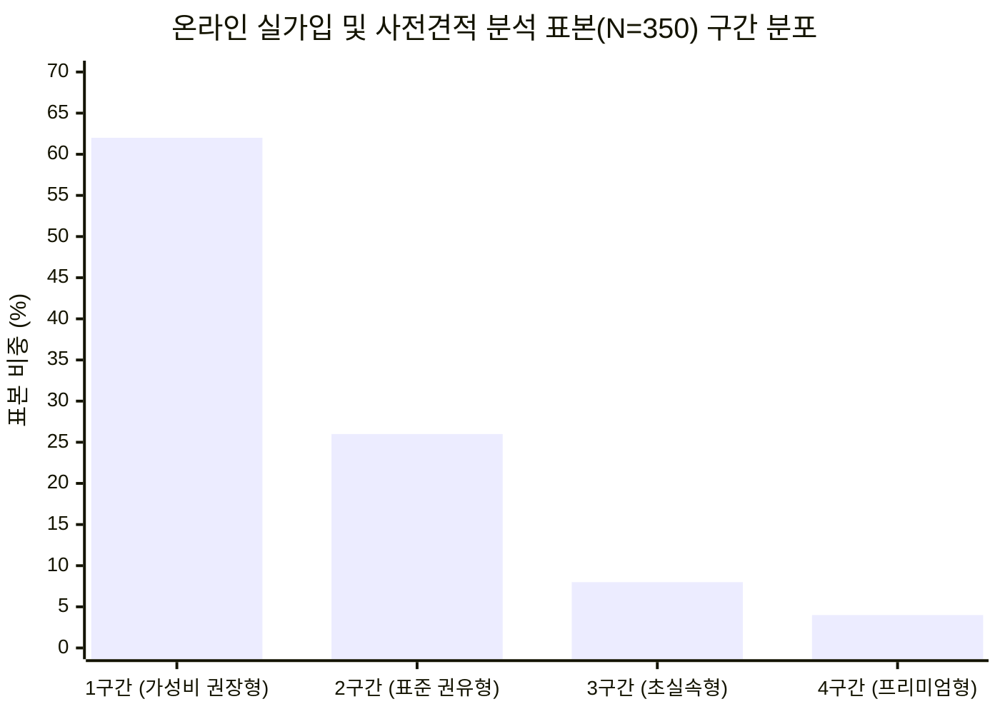

# [관찰 표본 리포트] 2026년 태아보험 보험료 구간

- **조사 기준일:** 2026년 10월 기준
- **표본 조사 설계 (통계 투명성 공시):**
  - **조사 대상:** 저장소가 온라인 커뮤니티의 실가입 인증 및 설계서 검토 게시글에서 수집했다고 설명하는 자료
  - **표본 수:** 총 N = 350건 (2026년 6월 ~ 2026년 9월로 기록된 계약 및 사전 견적 데이터)
  - **데이터 성격:** 공식 통계가 아닌 **익명 온라인 관찰 표본**. 표본별 원본 URL·수집 절차·포함 기준이 없어 모집단 대표성을 판단할 수 없음.
  - **익명화 원본 데이터셋:** [`raw_sources/market_sample_350_anonymized.json`](raw_sources/market_sample_350_anonymized.json) (350건 표본의 채널·계약형태·보험료·특약구성 세부 데이터 제공)
- **핵심 질문:** *"실제 합리적 가입을 지향하는 예비 부모들은 매월 얼마짜리 태아보험을 가장 많이 선택하는가?"*

---

## 1. 온라인 실가입 및 사전견적 분석 표본 기준 보험료 구간 분포

아래 값은 저장소에 포함된 **익명 관찰 표본(N=350)의 분포**입니다. “시장 전체 선호도”나 “실가입 평균”으로 해석하지 않습니다.

| 구분 | 월 납입액 (실비 포함 총액) | 현대해상 종합 단독 | 표본 비중 | 주요 설계 특징 및 가입자 조건 |
| :--- | :--- | :--- | :---: | :--- |
| **🥇 1구간 (가성비 권장형)** | **출생 후 월 5만 ~ 6만 원대** | **월 3.4만 ~ 4.0만 원** | **62% (217건)** | **20년납 30세 만기, 적립보험료 0원, 비효율 담보 배제** - 암 1억, 뇌/심장 2~4천, 질병후유장해 5천, 선천이상/저체중아 집중 |
| **🥈 2구간 (표준 권유형)** | **월 9만 ~ 13만 원대** | **월 7.0만 ~ 11.0만 원** | **26% (91건)** | **적립보험료 포함 or 80~100세 만기 복층 설계** - 설계사 기본 제안을 크게 수정하지 않고 수용한 군 |
| **🥉 3구간 (초실속형)** | **월 4만 원대 후반** | **월 2.4만 ~ 2.8만 원** | **8% (28건)** | **30세 만기 알뜰 다이어트 플랜** - 암 5천, 뇌/심장 1천, 질병후유장해 3천 |
| **4구간 (프리미엄형)** | **월 14만 ~ 18만 원 이상** | **월 12.0만 ~ 16.0만 원** | **4% (14건)** | **100세 만기 비갱신 풀담보형** - 고가 사은품 패키지 가입자 또는 고소득층 |

> **⚠️ 해석상 주의사항:**
> 위 62%는 이 표본에서 계산된 비중일 뿐입니다. 채널별 모집단, 게시글 노출 편향, 중복 제거와 실가입 여부를 독립적으로 확인할 수 없으므로 온라인 이용자 전체나 대한민국 전체의 선호도로 일반화하지 않습니다.

---

## 2. 1구간이 이 표본에서 많이 관찰된 이유에 대한 가설

아래는 표본 분포를 설명하기 위한 가설이며, 인과관계가 검증된 결과는 아닙니다.

### 1) '적립보험료 0원' 상식의 정착
- 만기환급금을 미끼로 얹어주던 2~4만 원의 적립보험료는 사업비만 차감되고 물가상승률을 방어하지 못한다는 인식이 확산.
- **적립보험료를 전액 삭제(0원)**하여 순수 보장보험료(3만 원대)만 납입하는 구조가 일반화됨.

### 2) '30세 만기 + 계약전환제도'의 효용성
- 100세 만기로 설계 시 월 12~14만 원이 발생하여 20년간 총 납입액이 3,000만 원에 육박함.
- 현대해상 굿앤굿의 계약전환 안내가 30세 만기 선택의 고려 요소가 될 수 있습니다. 다만 대상 담보와 전환 조건은 특별약관을 확인해야 합니다.

### 3) 20년 장기 납입의 '유지 가능성'
- 자녀 성장기(초·중·고) 교육비 지출 증가 시 월 12~15만 원의 고정 보험료는 중도 해지 리스크를 유발함.
- 월 5~6만 원대가 일부 가정의 예산 기준이 될 수 있지만, “가장 안정적”이라고 일반화하지 않습니다.

---

## 3. 한 다이렉트 견적에서 기록된 시기별 모의 보험료 흐름 (사설 벤치마크 예시)

저장소의 표준 프로필 모의 견적에서 관찰된 월 납입액 흐름 (2026-09-29 기록, 사설 벤치마크 예시치이며 공개 웹에 고정 공시된 값이 아님):

| 시기 | 현대해상 종합(Hi2607) | 5세대 태아 실손의료비 | **실제 합산 납입액** | 데이터 출처 성격 | 주요 변동 요인 |
| :--- | :--- | :--- | :--- | :---: | :--- |
| **임신 중 (출생 전)** | [약 24,770원](https://direct.hi.co.kr) | [약 17,790원](https://fine.fss.or.kr) | [**월 약 42,560원**](direct_quote_simulation_guide.md#step-5-태아-실손의료비-동시-가입-체크) | 사설 벤치마크 산출값 | 태아특약(선천이상/저체중아 등) 납입기 |
| **출생 직후 (0세 신생아기)** | [약 34,870원](https://direct.hi.co.kr) | [약 27,000원](https://fine.fss.or.kr) | [**월 약 61,870원**](direct_quote_simulation_guide.md#step-5-태아-실손의료비-동시-가입-체크) | 사설 벤치마크 산출값 | 이 견적에서 출생 직후 실손이 가장 높게 기록됨 |
| **만 1세 ~ 2세** | [약 34,870원](https://direct.hi.co.kr) | [약 14,000원 ~ 18,000원](https://fine.fss.or.kr) | [**월 약 48,000원 ~ 52,000원**](raw_sources/02_hyundai_good_and_good_policy_2026.md#1-상품-개요-및-최신-가입-인수-기준) | 사설 벤치마크 추정치 | 이 견적에서 태아특약 종료와 실손 요율 변화가 함께 반영됨 |
| **만 5세 이후 (초등 입학)** | [약 34,870원](https://direct.hi.co.kr) | [약 8,000원 ~ 10,000원](https://fine.fss.or.kr) | [**월 약 42,000원 ~ 44,000원**](raw_sources/02_hyundai_good_and_good_policy_2026.md#1-상품-개요-및-최신-가입-인수-기준) | 사설 벤치마크 추정치 | 이 견적에서 기록된 범위이며 이후 보험료를 보장하지 않음 |

---

## 4. 결론 및 실전 시사점

1. **이 표본의 관찰값:** 실손 포함 출생 후 월 5~6만 원대가 217건(62%)으로 집계되었습니다.
2. **검토 기준:** 월 10만 원을 넘는 설계는 적립보험료, 만기, 가입금액, 특약 수를 분해해 확인합니다. 금액만으로 과설계라고 판정하지 않습니다.

## 참고 페이지와 데이터 출처

**출처 조회 기준일: 2026-10-06**

| 출처 | 링크 | 이 리포트에서 사용하는 범위 |
| --- | --- | --- |
| 공식 보험료 산출 경로 | [현대해상 다이렉트](https://direct.hi.co.kr) | 42,560원·61,870원 등 표준 프로필 견적의 산출 페이지 |
| 공적 비교 경로 | [보험다모아](https://www.e-insmarket.or.kr) | 시장 비교를 위한 공적 비교 경로. N=350 표본의 모집단을 대체하지 않음 |
| 내부 데이터 | [`market_sample_350_anonymized.json`](raw_sources/market_sample_350_anonymized.json) | 350개 행과 217/91/28/14 구간 집계 |
| 출처 범위표 | [`SOURCE_MANIFEST.md`](SOURCE_MANIFEST.md) | 표본의 대표성·수집 범위를 설명하는 기준 문서 |
