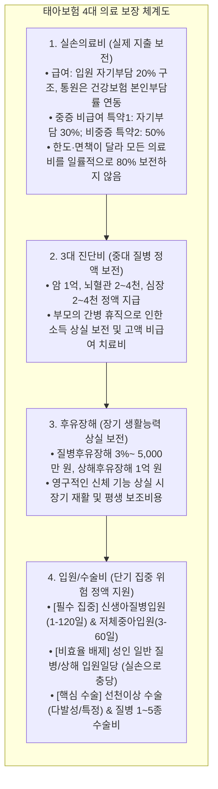

# [제도 2차 요약 05] 2026년 5세대 실손의료비 — 공식 자료 링크와 대조 필요

- **수집 및 분석 기준일:** 2026년 10월 최신 기준 (2026년 5월 6일 금융위원회 공식 시행 5세대 실손 체계 반영)
- **출처:** 금융위원회 공식 보도자료, 금융감독원 보험업감독업무시행세칙, 손해보험협회 표준약관 공시
- **핵심 키워드:** 2026년 5세대 실손의료보험, 임신·출산 급여 보장, 발달장애 18세 보장, 중증/비중증 비급여 분리, 4대 보장 역할 분리

---

## 1. 2026년 5세대 실손의료보험 공식 개정 팩트 분석 (금융위 시행 기준)

2026년 5월 6일부터 정식 출시된 5세대 실손의료비는 과잉 비급여 누수를 막고, 필수의료(임신·출산·소아 중증) 보장을 대폭 강화한 체계입니다.

### [5세대 실손 3단 보장 체계도 (금융위 표준안)]

```mermaid
flowchart TD
    subgraph S5["2026년 5세대 실손의료보험 3단 표준 체계"]
        direction TB

        subgraph Tier1["1. 급여 (기본계약)"]
            direction TB
            T1_1["급여 입원: 자기부담률 20%. 보장은 실제 급여 의료비, 약관상 한도·예외에 따름"]
            T1_2["급여 통원: 건강보험 본인부담률 연동 공제"]
            T1_3["신규: 임신·출산 급여의료비 (제왕절개 등 급여 본인부담금 보장)"]
            T1_4["특례: 태아 가입 시 소아 발달장애(F코드) 급여의료비 만 18세까지 보장"]
        end

        subgraph Tier2["중증 비급여 (특약 1)"]
            direction TB
            T2_1["대상: 암·뇌·심장 등 중증질환 및 희귀난치 질환 산정특례 치료 중심"]
            T2_2["산정특례 대상 중증질환 및 의학적 인과관계가 명확한 합병증 / 연간 5,000만 원 한도 / 자기부담률 30%"]
            T2_3["상급종합·종합병원 입원 시 연간 자기부담금 500만 원 초과분 보장; 적용대상·산정 방식은 현행 약관 확인"]
            T2_4["중증질환 치료 목적이라도 특약1의 보장대상·면책·의학적 기준을 충족해야 하며, 모든 비급여가 자동 보장되는 것은 아님"]
        end

        subgraph Tier3["비중증 비급여 (특약 2)"]
            direction TB
            T3_1["대상: 중증 질환에 해당하지 않는 일반 비급여 치료"]
            T3_2["보장 기준: 자기부담률 50%; 연간 1,000만 원, 통원 일당 20만 원, 입원 회당 300만 원 한도. 일부 비급여는 제외"]
            T3_3["보장 제외: 과잉진료 우려가 큰 도수치료·증식치료·체외충격파 등 비급여 근골격계 물리치료 및 비급여 영양제 주사료 등은 신규 비중증 비급여 보장에서 원칙적으로 제외"]
            T3_4["비급여 MRI/MRA: 질환 중증도 및 치료 목적(특약1 중증 vs 특약2 일반)에 따라 구분 적용"]
        end
    end
```

> **💡 5세대 비급여 개편의 핵심 요약 (팩트 체크):**  
> 5세대 실손은 4세대의 구조를 그대로 이름만 바꾼 상품이 아닙니다. 중증·비중증 비급여의 보상 범위·자기부담률·한도와 제외 항목을 현행 약관으로 확인해야 합니다.  
> - **중증 비급여(특약 1):** 산정특례 대상 중증질환 및 의학적 인과관계가 명확한 합병증 치료를 대상으로 하며, 연간 5,000만 원 한도·자기부담률 30%가 적용됩니다. 상급종합·종합병원 입원 시 연간 자기부담금 500만 원 초과분을 보장합니다. 모든 비급여 치료가 자동 보장되는 것은 아닙니다.  
> - **비중증 비급여(특약 2):** 비중증 비급여는 **자기부담률 50%, 연간 1,000만 원 한도**로 보장하되, 근골격계 물리치료·체외충격파·비급여 주사제·미등재 신의료기술 등 일부 항목은 보장에서 제외

---

## 2. 5세대 실손과 종합보험의 "4대 의료 보장 역할 분리 모델"

단순히 "실손이 있으니 다른 특약은 불필요하다"거나 "실손과 별개로 입원일당을 무조건 넣어야 한다"는 식의 단순화는 잘못된 접근입니다.  
태아보험은 다음 **4가지 상호보완적 역할 분리 원칙**에 따라 설계해야 하나의 비교 프레임으로 사용할 수 있습니다. 모든 가정에 최적인 설계라는 의미는 아닙니다:

1. **실손의료비 (실제 발생 의료비 보전):**
   - 자기부담률과 보상 한도는 급여·중증 비급여·비중증 비급여마다 다릅니다. “모든 병원비의 70~80%”처럼 일괄 표현하지 말고 실제 치료항목이 어느 담보에 해당하는지 약관을 확인합니다.
2. **3대 진단비 (정액 일시금 보전):**
   - 소아암, 뇌혈관 질환 등 발생 시 병원비 외에 **부모의 간병으로 인한 경제활동 중단(소득 공백)을 메우기 위한 일시금**.
3. **후유장해 (영구적 신체 손실 보전):**
   - 선천성 기형이나 중대 질환으로 신체에 3% 이상 장해가 남았을 때, 아이의 평생 재활치료 및 특수교육 비용 지원.
4. **입원일당의 선별적 운용 (성인형 배제, 신생아기 집중):**
   - 성인 질병입원일당은 실손과 지급 방식이 다릅니다. 예산과 정액 지급의 필요성에 따라 검토하며, 실손으로 완전히 대체된다고 단정하지 않습니다.
   - 단, 출생 직후 신생아 집중치료실(NICU) 및 인큐베이터 입원비는 병실료 차액이나 급성 위험이 집중되므로, **`신생아질병입원일당(1-120일)` 및 `저체중아입원일당`에 집중 구성**하는 것이 합리적입니다.

---

## 3. 태아 실손의료비 보험료 — 미검증 예시값은 현행 견적 근거가 아님

저장소 이전 버전에는 출생 전 17,790원, 출생 직후 27,000원 등의 수치가 있었지만, 이 작업 폴더에는 이를 재현할 수 있는 원본 견적 화면·견적번호·조회 시각·선택 담보 기록이 없습니다. 따라서 이 금액을 실측 데이터, 표준 요율 또는 향후 갱신 예측으로 인용하지 않습니다.

출생 전후 및 연령별 보험료 비교에는 공식 전산에서 각 시점의 실제 조건으로 새로 산출한 견적이 필요합니다. 공적 제도 안내 페이지는 보장 구조와 시행 정보를 설명하는 출처이지, 이 저장소의 개별 원화 보험료를 증명하지 않습니다. 특히 연령이 바뀌면 보험료가 자동으로 매년 하락한다고 가정해서는 안 됩니다.

## 4. 공식 웹 출처 및 검증 링크

| 출처명 | 링크 (URL) | 정보 유형 및 검증 내용 |
| :--- | :--- | :--- |
| **S3 금융위원회 공식 안내** | [5세대 실손 카드뉴스](https://www.fsc.go.kr/po010101/86831) | 2026년 5월 6일 시행, 급여·중증/비중증 비급여 분리, 임신·출산·발달장애 급여 보장 |
| **금융위·금감원 보도자료 (PDF 사본)** | [2026-05-06 시행 보도자료](https://kiri.or.kr/PDF/weeklytrend/20260518/trend20260518_4.pdf) | 급여와 중증/비중증 비급여의 자기부담·한도 및 제도 개요. 실제 약관 우선 |
| **금융감독원 파인** | [fine.fss.or.kr](https://fine.fss.or.kr) | 실손의료비 세대별 표준약관 및 급여/비급여 자기부담금 규정 |
| **손해보험협회 공시실** | [kpub.knia.or.kr](https://kpub.knia.or.kr) | 5세대 실손 연령별·성별 위험손해율 및 표준요율표 |
| **보험다모아 실손비교** | [e-insmarket.or.kr](https://www.e-insmarket.or.kr) | 손보협회 공인 다이렉트 실손보험료 비교 포털 |

이 문서의 제도 설명은 [S3 금융위원회 원문](https://www.fsc.go.kr/po010101/86831)을 기준으로 대조했습니다. 출생 전·후 17,790원·27,000원 등 보험료는 이전 저장소에 기록된 수치입니다. 원본 견적이 없어 실제 다이렉트 견적에서 나온 값인지 재현할 수 없으며, 공식 보도자료의 고정 요율표도 아닙니다.
