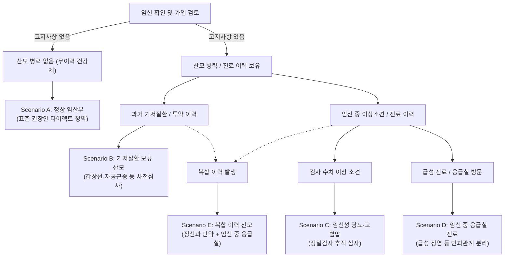

# [인수심사 설명용 시나리오] 산모 병력·임신 이상소견별 사전 확인 사항

- **작성 기준일:** 2026년 10월 최신 기준
- **적용 상품:** 현대해상 무배당 굿앤굿어린이종합보험Q (Hi2607) 및 주요 손해보험사 언더라이팅(인수심사) 실무 지침
- **목적:** 과거 치료력, 복용 약물, 임신 중 이상소견 또는 응급실 방문이 있을 때 청약서 질문을 확인하고 사전심사에 제출할 자료를 준비하도록 돕습니다. 보험사 내부 승인기준·승인률은 공개 자료로 확인되지 않아 결과 확률이나 인수 보장을 제시하지 않습니다.

> **⚠️ [필독] 표준 권장 견적과 실제 가입자의 개별 인수심사 분리 안내:**  
> 본 가이드의 과거 예시 보험료는 원본 견적서·화면 캡처·견적번호가 없어 실제 전산 산출 여부를 재현할 수 없는 미검증 값입니다. 이를 개인의 예상 보험료로 사용하지 않습니다.  
> 실제 산모에게 과거 정신건강의학과 치료·약물 복용 이력, 기저질환, 또는 최근 응급실/입원 진료 이력이 있는 경우, 다이렉트 전산상 자동승인이 불가하거나 인수심사(언더라이팅)를 거쳐 **가입금액 축소, 특정 부위 부담보, 보험료 할증, 또는 심사 유예/인수 제한이 발생**할 수 있습니다. (현대해상 공식 공시: 산모의 건강상태 및 병력에 따라 가입금액 제한 또는 가입불가 가능).  
> 따라서 본 가이드의 표준 견적을 "나의 확정 가입 금액"으로 단정하지 마시고, 병력이 있는 경우 본 문서의 시나리오별 지침에 따라 사전심사를 진행해야 합니다.

---

> **중요한 한계 — 승인 가능성 예측표가 아님 (2026-10-10):** 이 문서는 청약 전 준비할 질문과 자료를 설명하는 일반 안내입니다. 보험사의 내부 인수기준, 상품 버전, 산모/태아의 실제 진료기록과 청약서 질문이 공개되어 있지 않으므로, 특정 병력·검사 수치·투약 중단 기간이 표준체 승인 또는 태아특약 가입을 보장한다고 예측할 수 없습니다. 아래 시나리오의 수용 경향이나 우선순위는 검증된 승인률 통계가 아닙니다. 해당 담보를 가입할 수 있다고 미리 단정하지 말고, 정확한 사실을 청약서에 고지하고 보험사에 서면 사전심사를 요청하십시오.

## 🧭 계약 전 알릴 의무(고지의무) 법리 및 기본 원칙

### 1. 상법상 고지의무와 청약서 질문표의 법적 성격
- **상법 제651조 (고지의무):** 보험계약 당시에 보험계약자 또는 피보험자가 고의 또는 중대한 과실로 인하여 **'중요한 사항'**을 고지하지 아니하거나 부실의 고지를 한 때에는 보험사는 계약을 해지할 수 있습니다.
- **상법 제651조의2 (서면에 의한 질문의 효력):** 3개월, 1년, 5년 등의 기간은 상법 본문에 숫자로 명시된 법정 기간이 아니라, **보험사가 서면(청약서 질문표)으로 질문한 사항은 '중요한 사항'으로 추정**한다는 법리에 따른 것입니다.
- 청약서의 서면 질문은 중요한 사항으로 추정되지만, 제651조의2만으로 질문표에 없는 모든 사실의 법적 중요성이 자동으로 부정되는 것은 아닙니다. **질문 문구와 사실관계가 애매하면 누락 여부를 스스로 판단하지 말고 보험사에 서면으로 문의해 답변을 보관하십시오.** 청약서에는 질문에 해당하는 사실을 정확하게 답합니다.

### 2. 표준 약관 청약서 질문표의 대표적 질문기간 예시 (상법 제651조의2 기준)
> **안내:** 아래는 통상적인 손해보험사 청약서 질문표에서 사용하는 대표적인 질문기간의 예시이며, 실제 법적 고지의무는 청약 시점에 가입하려는 개별 상품 청약서/질문서에 명시된 구체적 질문 항목을 기준으로 판단해야 합니다.

1. **최근 3개월 이내:** 의사로부터 진찰 또는 검사를 통하여 질병확정진단, 질병의심소견, 치료, 입원, 수술, 투약(처방)을 받은 사실.
2. **최근 1년 이내:** 의사로부터 진찰 또는 검사를 통하여 추가검사(재검사)를 받은 사실.
3. **최근 5년 이내:** 입원, 수술(제왕절개 포함), 계속하여 7일 이상 치료, 계속하여 30일 이상 투약을 받은 사실.
4. **최근 5년 이내 11대 중대질병:** 암, 백혈병, 고혈압, 당뇨병, 심장판막증 등 진단·치료 사실.

### 3. 고지의무 위반과 인과관계의 법리 (상법 제655조 단서)
- **상법 제655조 본문:** 고지의무를 위반한 경우 보험사는 보험금 지급 책임을 면하며 계약을 해지할 수 있습니다.
- **상법 제655조 단서 (인과관계 부존재에 따른 책임 존속):**  
  > *"그러나 고지의무를 위반한 사실이 보험사고 발생에 영향을 미치지 아니하였음이 증명된 때에는 보험금을 지급하여야 한다."*
- **실무적 의미:**
  과거 경증 피부염과 출생 후 선천성 심장 기형(VSD)의 관련성처럼, 고지의무 위반과 보험사고의 인과관계는 사고 내용·진료기록·약관을 바탕으로 개별 판단해야 합니다. 특정 병력이 특정 태아 질환과 “전혀 관계없다”고 미리 단정하거나 이를 고지하지 않아도 된다는 근거로 사용해서는 안 됩니다.
  고지의무 위반이 문제 되면 인과관계와 입증 책임을 둘러싼 분쟁이 생길 수 있습니다. 대법원 2025. 1. 9. 선고 2024다272941 판결은 사고와의 인과관계가 없다는 점의 증명책임이 보험계약자 측에 있고, 인과관계를 인정할 여지가 있으면 상법 제655조 단서 적용이 제한될 수 있음을 다뤘습니다. 이는 개별 사건의 기록·질문 문구·의학적 사실을 대신하는 일반 면책 규칙이 아닙니다. **청약서 질문표에 사실대로 답하고, 애매한 사항은 보험사에 서면 확인하며, 보험사의 공식 인수 결과를 보관하는 것이 원칙**입니다. 법률 판단이 필요한 분쟁은 전문가 상담을 권합니다.

---

## 📋 5대 실전 인수 시나리오 의사결정 트리

---

### Scenario A — 정상 임산부 (무이력 건강체)

- **산모 상태:** 최근 5년 이내 수술/입원/장기투약 이력이 없고, 현재 임신 과정에서 단 한 번도 이상소견이나 유산방지제 처방이 없는 경우.
- **인수 결과:** **일반적으로 전산 자동승인(Clean Pass) 가능성이 가장 높은 시나리오** (단, 최종 승인은 보험사 전산 심사규칙 및 실시간 스코어링 기준에 따름).
- **실전 행동 지침:**
  - 공식 다이렉트/설계 채널에서 현재 판매 중인 상품 버전과 개별 특약 가입 마감 주수를 확인하고, 실제 입력값으로 산출된 견적을 저장합니다.
  - 특정 검사 전 가입을 일률적으로 권하지 않습니다. 다만 일부 특약에 주수 제한이 있을 수 있으므로, 해당 특약의 조건을 공식 약관·전산에서 확인하고 필요한 질문은 보험사에 서면으로 문의합니다.

---

### Scenario B — 과거 기저질환 및 약물 복용 이력이 있는 산모

대표적 사례: 갑상선기능저하증(씬지로이드 복용), 다낭성난소증후군, 자궁근종(단순 추적관찰), 완치된 B형간염 보균 등.

#### 1. 주요 질환별 일반적 심사 기준:
- **갑상선기능저하증 / 항진증:**
  - *인수 경향:* 약물 복용 중이라도 최근 6개월 이내 갑상선 기능 수치(TSH, Free T4)가 정상 범위로 안정화되어 있다면 종합보험 및 태아특약의 인수 결과는 개별 심사에 따라 달라짐.
  - *필요 서류:* 의무기록사본(최근 1~2회 외래기록), 혈액검사 결과지.
- **자궁근종 / 난소낭종 (단순 물혹):**
  - *확인사항:* 근종의 위치·크기·추적 기록·치료 이력과 청약서 질문표가 심사 대상인지 확인합니다. “단순 추적관찰이면 정상 인수”라고 예측할 근거는 없습니다.
- **다낭성난소증후군 / 배란유도제(클로미펜) 복용 후 자연 임신:**
  - *확인사항:* 배란유도제·시술 여부, 임신 경과, 진료 기록과 실제 질문 항목을 보험사에 제시합니다. 정상 심박동만으로 인수 결과를 예측할 수 없습니다.

#### 2. 실전 행동 지침:
- 다이렉트 전산에서 고지사항을 입력하면 시스템상 '심사 대상(대면 지점 이관)'으로 분류될 수 있습니다.
- 사전에 담당 주치의로부터 **"소견서(현재 약물 복용 또는 추적관찰 중으로 안정적이며 임신 유지에 지장 없음)" 및 "최근 검사결과지"**를 구비하여 사전 심사를 요청하는 것이 안전합니다.

---

### Scenario C — 임신 중 검사 이상소견이 발생한 경우

대표적 사례: 1차 기형아 검사 목투명대(NT) 3.0mm 이상 비후, NIPT(비침습 산전검사) 고위험군 판정, 쿼드 검사 고위험, 정밀초음파상 심실중격결손(VSD) 의심 등.

#### 1. 이상소견별 인수 제한 또는 심사 유예 가능성이 높은 담보:
- **목투명대 비후 (3mm 이상) 또는 NIPT 고위험군:**
  - *영향 담보:* 선천이상 수술비, 신생아 장해출생담보 등 염색체/선천 기형 관련 태아특약 인수 제한 또는 심사 유예(보류).
  - *양수검사(확진검사) 결과가 있는 경우:* 결과지와 담당의 소견을 제출해 재심사 가능 여부를 서면 문의할 수 있습니다. 검사 결과만으로 인수 승인이나 부담보 해제를 보장하지 않습니다.
- **초음파상 태아 뇌실 확장, 심장 반점(EIF) 소견:**
  - 뇌혈관질환 진단비 또는 심혈관 관련 특약의 인수가 제한되거나 유예될 수 있음.

#### 2. 실전 행동 지침:
- **가입 시점 확인:** 검사 전 가입을 모든 산모에게 우선 권고하거나 검사를 미루도록 안내하지 않습니다. 담보별 가입 가능 주수와 질문표를 확인하되, 산전검사는 담당 의료진의 일정과 권고에 따라 진행합니다.
- 이미 소견을 받았다면 확진 검사(양수검사/정밀초음파) 결과를 확인한 후, 정상 판정 의무기록을 첨부하여 심사를 재신청합니다.

---

### Scenario D — 임신 중 입원, 수술, 절박유산 치료 이력이 있는 산모

대표적 사례: 임신 초기 피고임(융모막하혈종), 절박유산 진단 및 유산방지제(질정/주사) 처방, 조기진통(자궁수축억제제 라보파/트랙토실 투여), 자궁경부길이 단축 입원.

#### 1. 주요 진료별 인수 심사 경향:
- **임신 초기 피고임 / 유산방지 질정(유트로게스탄 등) 처방:**
  - *인수 경향:* 출혈이 멈추거나 초음파 소견이 호전되어도 인수 결과를 보장하지 않습니다. 진단/치료 기록, 추적검사, 산부인과 소견과 청약서 문항을 제출하고 보험사의 사전심사 결과를 확인해야 합니다.
- **절박유산 또는 조기진통으로 인한 입원:**
  - *확인사항:* 퇴원 여부·진단명·검사 결과·추가 치료 여부를 보험사에 설명하고, 요청받은 진료기록과 소견서를 제출합니다. 심사 유예 기간과 재심사 조건은 공개된 공통 기준으로 단정할 수 없습니다.
  - *담보 영향:* 산모 전용 특약은 인수가 제한될 수 있으나, **태아특약은 산모 관련 담보와 별도로 심사될 수 있지만, 소견서와 정상 초음파만으로 가입 가능하다고 판단할 수 없습니다. 특약별 사전심사가 필요합니다.**.

#### 2. 실전 행동 지침:
- 단순 온라인 가입 버튼을 누르기 전, **병원 진료기록(입퇴원확인서, 초음파 결과지, 안정화 소견서)**을 확보하여 보험사 언더라이터에게 "현재는 치료 종결 후 정상 임신 유지 중"임을 서면 소명해야 합니다.

---

### Scenario E — [실전 복합 사례] 정신건강의학과 투약 중단 + 최근 응급실 방문 산모

실제 다수의 예비 부모가 직면하는 가장 현실적이고 복합적인 사례입니다:  
**"산모가 과거 수개월~수년간 정신과 약물(우울증/불안장애 등)을 복용하다가 임신을 준비하며 완전히 단약(복용 중단)하였고, 임신 후 산부인과 검진은 모두 정상이지만, 최근 단순 복통이나 컨디션 난조로 응급실을 방문하여 검사 후 이상 없이 당일 귀가한 경우."**

#### 1. 언더라이팅 평가를 좌우하는 8대 핵심 변수 분석 매트릭스

| 평가 변수 | 세부 판단 기준 | 보험사 언더라이팅 심사 관점 | 태아/산모 담보별 예상 영향 |
| :--- | :--- | :--- | :--- |
| **① 현재 치료/투약 여부** | 치료 종결 및 복용 중단 상태인지 여부 | 임신 중 지속 투약 여부가 태아 최기형성 리스크의 핵심 평가 요소 | 복용 중단 및 안정 상태 확인 시 일반적 심사상 위험 평가 완화 경향 (보험사 사전심사 필요) |
| **② 투약 종료 시점** | 임신 확인 전(수개월 전) 중단 vs 최근 3개월 내 중단 | 최근 3개월 내 처방 사실이 있다면 청약서 1번 문항(3개월 내 투약) 필수 고지 대상 | 가입 시점과 무관하게 청약 시점의 서면 질문표 문항에 사실대로 정확히 고지하고, 소견서로 현재 안정 상태를 소명하는 것이 원칙 (고지 회피 목적의 청약 지연 불필요) |
| **③ 진단명 및 질병분류코드** | 경증 불안/불면/적응장애(F41, F51) vs 주요우울장애(F32) vs 조현병/양극성 | 정신건강 관련 진단/투약 이력의 인수 가능성은 진단명·치료 경과·최근 진료·약제·상품별 질문표와 회사별 기준에 따라 달라집니다. 일반적 승인 가능성 순위를 제시할 근거는 없습니다. 서면 사전심사가 필요합니다. | 승인 가능성에 관한 비교 통계가 없으므로 표준체 승인 가능성이 더 높다고 결론내리지 않습니다. |
| **④ 총 치료·투약 일수** | 최근 5년 이내 계속하여 30일 이상 투약 여부 | 30일 이상 투약 이력이 있다면 청약서 3번 문항(5년 내 장기투약) 필수 고지 대상 | 고지 후 단약 안정화 소견서로 소명 필요 |
| **⑤ 산부인과 산전검사 상태** | 주수별 태아 크기, 심박동, 초음파 소견 | 보험사가 요청하는 자료인지 확인 | 검사 결과 하나만으로 태아특약 인수 여부가 결정되지는 않음 |
| **⑥ 응급실 방문 사유 및 결과** | 방문 사유, 진단명, 검사, 입원 여부 및 후속 진료 | 청약서 질문에 해당하는 진찰·검사·의심소견 여부 검토 | 당일 귀가만으로 인수 결과나 임신 위험을 추정하지 않음 |
| **⑦ 응급실 검사 결과 기록** | 검사결과와 의무기록상 진단·의심소견 | 해당 문서가 청약서 질문에 해당하는지 확인 | 정상 결과라고 심사 유예나 추가서류 요청이 자동 종료된다고 볼 수 없음 |
| **⑧ 응급실 진료 시점 경과일** | 응급실 방문일, 이후 진료·검사·투약 여부 | 실제 질문표의 기간과 질문 대상 사실을 대조 | 고지 회피를 위해 접수를 늦추지 말고 질문표에 정확히 답함. 추가서류와 심사 시점은 보험사에 확인 |

#### 2. 담보군별 언더라이팅 결과 분리 예측:
1. **아기 중심 핵심 담보 (태아특약 / 어린이종합보험):**
   - **보험사의 내부 심사 자료가 없으므로 태아 담보 인수 가능성의 상대 순위를 매기지 않습니다. 반드시 해당 보험사의 사전심사 결과를 확인합니다.**
   - **판정 논리:** 산모의 과거 정신건강 진료/투약과 최근 응급실 방문이 심사에 미치는 영향은 진단명, 기간, 진료기록, 질문표와 보험사 기준에 따라 달라집니다. 태아 초음파가 정상이어도 특약 가입이 보장되지 않으므로 사실관계를 고지하고 서면 사전심사를 요청합니다.
2. **산모 전용 특약 (모성 특약 / 임신·출산 관련 담보):**
   - **일반적 심사 경향: [산모 담보 조건부 인수, 특정 질환 부담보, 또는 인수 제한 가능성 (보험사별 심사 필요)]**
   - **판정 논리:** 산모 본인을 피보험자로 하는 특약은 아기 담보와 다른 질문·심사 기준을 적용할 수 있습니다. 어떤 담보가 가입 가능한지와 제한 조건은 보험사에 각각 확인해야 합니다.

#### 3. 실전 통과를 위한 3단계 서류 준비 지침:
1. **정신건강의학과:** "임신 전 치료 및 투약이 종결되었으며, 현재 임신 유지 및 일상생활에 이상 없음" 취지의 **치료종결 소견서 또는 진료확인서**.
2. **산부인과:** 최근 진료일 기준 **태아 초음파 결과지(태아 크기, 심박동 정상) 및 산전 진료확인서**.
3. **응급실:** 해당 병원 의무기록실에서 **'응급실 진료기록지' 및 '진료비 세부내역서'**를 발급받아 "이상소견 없이 증상 호전되어 당일 퇴원" 항목을 명확히 확보하여 제출.

---

## 🛡️ 고지의무 준수의 현실적 중요성

1. **사후 조사(손해사정)의 현실:**  
   출생 직후 신생아가 저체중아로 인큐베이터에 입원하거나 선천 질환으로 고액 수술을 받을 경우, 보험사는 고액 보험금 지급 전 손해사정 현장 심사를 통해 산모의 산전 진료기록 및 건강보험공단 요양급여내역을 대조·확인합니다.
2. **분쟁 예방을 위한 정도(正道):**  
   고지의무 위반 사실이 적발되면 인과관계 입증을 둘러싸고 수개월간 보험금 지급이 보류되거나 금융감독원 민원·소송전으로 비화될 수 있습니다. 병력이 있다면 청약서 질문표에 맞추어 적법하게 고지하고, 소견서를 완비하여 보험사의 공식 인수 결과와 청약 조건을 확인한 후 계약 여부를 판단입니다.

## 참고 페이지와 법적 근거

**출처 조회 기준일: 2026-10-10**

| ID | 참고 페이지 | 이 문서에서 뒷받침하는 내용 |
| --- | --- | --- |
| [S1](SOURCE_MANIFEST.md) | [현대해상 굿앤굿 상품 안내](https://m.hi.co.kr/serviceAction.do?kw=00004F&menu=36&menuId=100222&src=text) | 상품별 가입 조건, 일부 담보의 임신 주수 제한, 계약전환 대상 담보 |
| [S4](SOURCE_MANIFEST.md) | [상법 제655조](https://www.law.go.kr/LSW/lsLawLinkInfo.do?chrClsCd=010202&lsJoLnkSeq=1008161137) | 고지의무 위반과 보험사고의 인과관계가 문제 되는 법적 구조 |
| [S5](SOURCE_MANIFEST.md) | [대법원 95다25268](https://www.law.go.kr/LSW/precInfoP.do?precSeq=152771) | 과거 판례 참고(현행 쟁점은 아래 최근 판결과 함께 확인) |
| [S9](SOURCE_MANIFEST.md) | [대법원 2024다272941 (2025.1.9.)](https://law.go.kr/LSW/precInfoP.do?mode=0&precSeq=600295) | 인과관계 부존재의 증명책임과 상법 제655조 단서 적용 범위 |

시나리오별 인수 결과·필요 서류는 보험사의 내부 심사기준과 실제 진료기록에 따라 달라지므로, 위 법적 근거가 개별 가입 결과를 보장한다는 뜻은 아닙니다.
